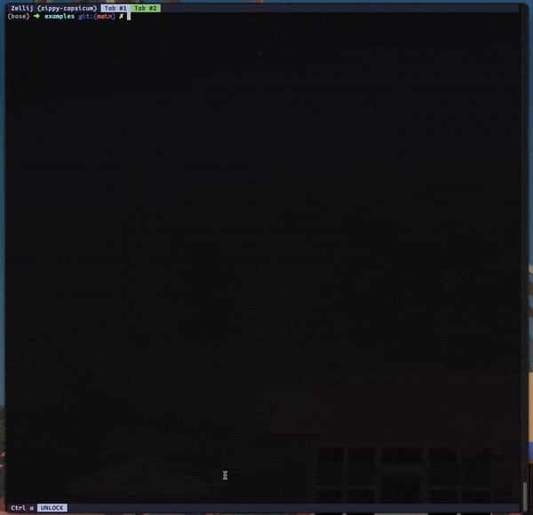

# .--. -.-.

**PodCraft**: Run podman quadlets locally.



---

PodCraft is a CLI utility designed to enable the local execution of podman quadlets, addressing the lack of support for running quadlets locally, particularly on macOS.

---

## Features

- **Simulate Pod Commands**: Generate and inspect podman commands intended to run your quadlets locally without executing them.
- **Create Pods**: Transform quadlet configurations into running podman pods.
- **Destroy Pods**: Clean up resources associated with your pods.
- **Prepare for Production**: Write standard quadlet unit files for deployment.

---

## Installation

PodCraft is not quite ready for prime time. It's in a **proof of concept** stage (code is not well tested and there are bugs).

If you'd like to try it out anyway you can clone the repository and install it with go:

```bash
git clone https://github.com/zulubit/podcraft.git
cd podcraft
go install ./cmd/podcraft
```

---

## Usage

```plaintext
.--. -.-.

podcraft is a CLI utility designed to enable local execution of podman quadlets,
addressing the lack of support for local quadlet execution. This tool lets you configure, simulate, and run pods locally.

Usage:
  podcraft [command]

Available Commands:
  create      Create and optionally start the pod
  destroy     Remove the pod and clean up resources
  dry         Simulate pod commands
  help        Help about any command
  put         Prepare and save quadlets for production

Flags:
  -h, --help   help for podcraft

Use "podcraft [command] --help" for more information about a command.
```

---

## Commands Overview

### `dry`
**Simulate pod commands**

Simulates and generates the podman commands required to run the configured quadlets locally. Useful for inspecting and debugging configurations before execution.

```bash
podcraft dry 
```

---

### `create`
**Create and optionally start the pod**

Generates and executes the podman commands necessary to create a pod. Use the `--start` flag to start the pod immediately.

```bash
podcraft create --start
```

---

### `destroy`
**Remove the pod and clean up resources**

Forcefully removes the specified pod and prunes networks. Volumes are not removed.

```bash
podcraft destroy
```

---

### `put`
**Prepare and save quadlets for production**

Processes the custom configuration file and generates standard systemd unit files for production deployment.

```bash
podcraft put --location ./folder
```

---

## Configuration Example

PodCraft uses a custom TOML configuration format for defining quadlets. Here is an example configuration for a WordPress application:

```toml
[main_pod]
name = "wordpress-pod"
quadlet = """
[Unit]
After=network.target

[Pod]

[Install]
WantedBy=multi-user.target default.target
"""

[[replaceables]]
id = "a"
dev = "wordpress.network"
prod = "wordpress-prod.network"

[[quadlets]]
name = "wordpress-app"
type = "Container"
quadlet = """
[Container]
Label=app=wordpress
Pod=wordpress-pod
ContainerName=wordpress-app
Image=docker.io/library/wordpress:6
Network=<<.a>>
PublishPort=8080:80
Volume=wordpress-app.volume:/var/www/html
Environment=WORDPRESS_DB_HOST=wordpress-db
Environment=WORDPRESS_DB_USER=wordpress
Environment=WORDPRESS_DB_NAME=wordpress
Environment=WORDPRESS_DB_PASSWORD=password
"""

[[quadlets]]
name = "wordpress-db"
type = "Container"
quadlet = """
[Container]
Label=app=wordpress
Pod=wordpress-pod
Image=docker.io/library/mariadb:10
ContainerName=wordpress-db
Network=wordpress.network
Volume=wordpress-db.volume:/var/lib/mysql
Environment=MARIADB_RANDOM_ROOT_PASSWORD=1
Environment=MARIADB_USER=wordpress
Environment=MARIADB_DATABASE=wordpress
Environment=MARIADB_PASSWORD=password
"""

[[quadlets]]
name = "wordpress-db"
type = "Volume"
quadlet = """
[Volume]
"""

[[quadlets]]
name = "wordpress-app"
type = "Volume"
quadlet = """
[Volume]
"""

[[quadlets]]
name = "wordpress"
type = "Network"
quadlet = """
[Network]
"""
```

---

## Explanation of Configuration

### **1. `[main_pod]` Section**

The `[main_pod]` section defines the primary pod that will group all the containers, volumes, and networks. This section is **mandatory** and ensures a consistent structure for defining and managing quadlets. While this requirement might seem restrictive, it greatly simplifies the internal logic of PodCraft for now.

#### Fields:
- **`name`**: The name of the pod.
- **`quadlet`**: The systemd unit definition for the pod, written as a string block. This uses standard systemd quadlet syntax.

#### Example:

```toml
[main_pod]
name = "wordpress-pod"
quadlet = """
[Unit]
After=network.target

[Pod]

[Install]
WantedBy=multi-user.target default.target
"""
```

This example defines a pod named `wordpress-pod` with:
- A dependency on the network being available (`After=network.target`).
- A systemd configuration to start automatically on boot (`WantedBy=multi-user.target default.target`).

---

### **2. `[[quadlets]]` Section**

The `[[quadlets]]` section defines the individual quadlets that make up the pod. Each quadlet specifies the following:

- **`name`**: The name of the quadlet.
- **`type`**: The type of quadlet (`Container`, `Volume`, or `Network`).
- **`quadlet`**: The systemd definition for the quadlet, written as a string block.

Example:

```toml
[[quadlets]]
name = "wordpress-app"
type = "Container"
quadlet = """
[Container]
Label=app=wordpress
Pod=wordpress-pod
ContainerName=wordpress-app
Image=docker.io/library/wordpress:6
Network=<<.a>>
PublishPort=8080:80
Volume=wordpress-app.volume:/var/www/html
Environment=WORDPRESS_DB_HOST=wordpress-db
Environment=WORDPRESS_DB_USER=wordpress
Environment=WORDPRESS_DB_NAME=wordpress
Environment=WORDPRESS_DB_PASSWORD=password
"""
```

This example defines a container named `wordpress-app` that:
- Is part of the `wordpress-pod`.
- Uses the `<<.a>>` replaceable to dynamically set its network.
- Exposes port 8080.
- Sets environment variables for WordPress to connect to a database container.

---

### **3. `[[replaceables]]` Section**

The `[[replaceables]]` section allows you to define variables (referred to as "replaceables") that will be dynamically substituted throughout the configuration. These replaceables are designed to handle environment-specific differences, such as development and production setups.

Each replaceable includes:

- **`id`**: A unique identifier for the replaceable.
- **`dev`**: The value to use in development environments.
- **`prod`**: The value to use in production environments.

Replaceables are replaced using a Go `text/template` engine. Anywhere in the TOML file where `<<.[id]>>` is found, it will be substituted with the value from either `dev` or `prod` based on the environment (`--prod` flag determines this).

Example:

```toml
[[replaceables]]
id = "a"
dev = "wordpress.network"
prod = "wordpress-prod.network"
```

In this example, `<<.a>>` will be replaced with:
- `wordpress.network` in development.
- `wordpress-prod.network` in production.

This is particularly useful for handling differences such as network names, volume mounts, or other environment-specific details.
